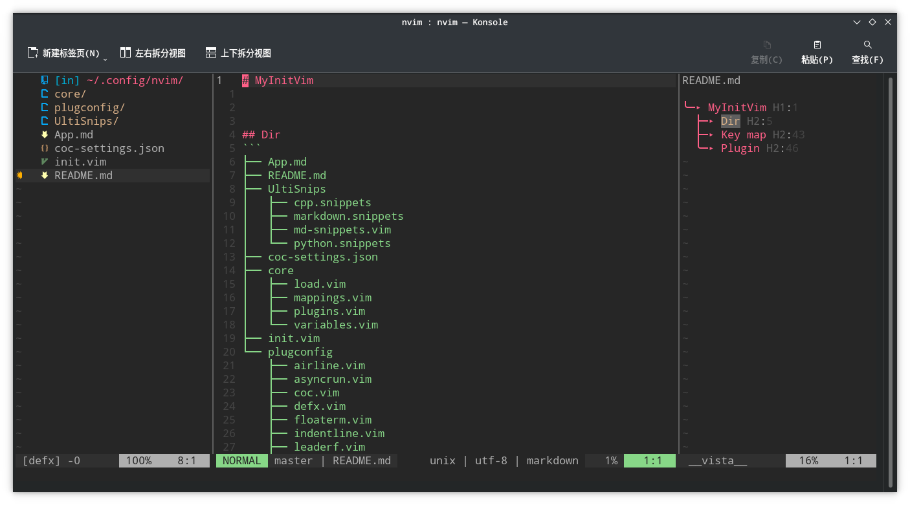

# MyInitVim

 


## Dir
```
├── App.md
├── README.md
├── UltiSnips
│   ├── cpp.snippets
│   ├── markdown.snippets
│   ├── md-snippets.vim
│   └── python.snippets
├── coc-settings.json
├── core
│   ├── load.vim
│   ├── mappings.vim
│   ├── plugins.vim
│   └── variables.vim
├── init.vim
└── plugconfig
    ├── airline.vim
    ├── asyncrun.vim
    ├── coc.vim
    ├── defx.vim
    ├── floaterm.vim
    ├── indentline.vim
    ├── leaderf.vim
    ├── lightline.vim
    ├── nerdtree.vim
    ├── snippets.vim
    ├── vista.vim
    └── visualmulti.vim
```


* file
	- coc-settings.json : config file used to complete
	- init.vim : vim config file entrance


## Key map


## Plugin

* My vimrc plug:

	* Plug 'itchyny/lightline.vim'
	* Plug 'itchyny/vim-gitbranch'
	* Plug 'jiangmiao/auto-pairs'
	* Plug 'liuchengxu/vista.vim'
	* Plug 'voldikss/vim-floaterm'
	* Plug 'mhinz/vim-startify'
	* Plug 'iamcco/markdown-preview.nvim', { 'do': { -> mkdp#util#install() }, 'for': ['markdown', 'vim-plug']}
	* Plug 'plasticboy/vim-markdown'
	* Plug 'godlygeek/tabular'
	* Plug 'SirVer/ultisnips'
	* Plug 'Chiel92/vim-autoformat'
	* Plug 'tpope/vim-surround'
	* Plug 'sheerun/vim-polyglot'
	* Plug 'Yggdroot/indentLine'
	* Plug 'Yggdroot/LeaderF'
	* Plug 'skywind3000/asyncrun.vim'
	* Plug 'mg979/vim-visual-multi', {'branch': 'master'}
	* Plug 'matze/vim-move'
	* Plug 'ryanoasis/vim-devicons'
	* Plug 'itchyny/vim-cursorword'
	* Plug 'neoclide/coc.nvim',{'branch':'release'}
	* Plug 'Shougo/defx.nvim', { 'do': ':UpdateRemotePlugins' }
	* Plug 'kristijanhusak/defx-icons'
	* Plug 'kristijanhusak/defx-git'
	* Plug 'morhetz/gruvbox'
	* Plug 'joshdick/onedark.vim'
	* Plug 'airblade/vim-gitgutter'
	* Plug 'tyru/caw.vim'

* table describe

| Number | Rec                            | Plug Name                                                         | Desc                                |
|:------:|:------------------------------:|:-----------------------------------------------------------------:|:------------------------------------|
| 1      | :star::star::star::star:       | [lightline.vim](https://www.github.com/itchyny/lightline.vim)     | status column                       |
| 2      | :star:                         | [vim-gitbranch](https://www.github.com/itchyny/vim-gitbranch)     | show git branch name                |
| 3      | :star::star::star::star:       | [auto-pairs](https://www.github.com/jiangmiao/auto-pairs)         | auto complete {} () []              |
| 4      | :star::star::star:             | [vista.vim](https://www.github.com/liuchengxu/vista.vim)          | show tags, acquired ctags support   |
| 5      | :star::star::star::star::star: | [vim-floaterm](https://www.github.com/voldikss/vim-floaterm)      | float terminal                      |
| 6      | :star::star:                   | [vim-startify](https://www.github.com/mhinz/vim-startify)         | start menu                          |
| 7      | :star::star::star::star::star: | [markdown-preview.nvim](https://www.github.com/markdown)          | markdown preview using broswer      |
| 8      | :star::star::star:             | [vim-markdown](https://www.github.com/plasticboy/vim-markdown)    | hihtlight markdown syntax           |
| 9      | :star::star::star::star:       | [tabular](https://www.github.com/godlygeek/tabular)               | format table                        |
| 10     | :star::star::star:             | [ultisnips](https://www.github.com/SirVer/ultisnips)              | code snippets                       |
| 11     | :star::star::star:             | [vim-autoformat](https://www.github.com/Chiel92/vim-autoformat)   |                                     |
| 12     | :star::star::star:             | [vim-surround](https://www.github.com/tpope/vim-surround)         | add sign between a word or sentence |
| 13     | :star::star::star::star:       | [vim-polyglot](https://www.github.com/sheerun/vim-polyglot)       | choose plugin automatically         |
| 14     | :star::star::star:             | [indentLine](https://www.github.com/Yggdroot/indentLine)          | indent line for python              |
| 15     | :star::star::star::star:       | [LeaderF](https://www.github.com/Yggdroot/LeaderF)                | search content                      |
| 16     | :star::star::star:             | [asyncrun.vim](https://www.github.com/skywind3000/asyncrun.vim)   | run code                            |
| 17     | :star::star::star::star:       | [vim-visual-multi](https://www.github.com/mg979/vim-visual-multi) | multi cursor                        |
| 18     | :star::star::star:             | [vim-move](https://www.github.com/matze/vim-move)                 | move code                           |
| 19     | :star::star::star:             | [vim-devicons](https://www.github.com/ryanoasis/vim-devicons)     | icons                               |
| 20     | :star::star::star::star:       | [vim-cursorword](https://www.github.com/itchyny/vim-cursorword)   | highlight current word              |
| 21     | :star::star::star::star::star: | [coc.nvim](https://www.github.com/neoclide/coc.nvim)              | Main function:complete              |
| 22     | :star::star::star::star:       | [defx.nvim](https://www.github.com/Shougo/defx.nvim)              | tree file                           |
| 23     | :star::star::star::star:       | [defx-icons](https://www.github.com/kristijanhusak/defx-icons)    | icon in defx                        |
| 24     | :star::star::star::star:       | [defx-git](https://www.github.com/kristijanhusak/defx-git)        | git mark                            |
| 25     | :star::star::star::star:       | [vim-gitgutter](https://www.github.com/morhetz/gruvbox)           | git staus shows                     |
| 26     | :star::star::star:             | [gruvbox](https://www.github.com/joshdick/onedark.vim)            | theme                               |
| 27     | :star::star::star::star:       | [onedark.vim](https://www.github.com/airblade/vim-gitgutter)      | theme                               |
| 28     | :star::star::star::star:       | [caw.vim](https://www.github.com/tyru/caw.vim)                    | Annoatation                         |


**Note** in coc managerment, install plug behind
- coc-clangd\
	`install clangd`
- coc-css
- coc-explorer
- coc-go\
	`install gopls`
- coc-html
- coc-jedi
- coc-json
- coc-python
- coc-snippets
- coc-texlab
- coc-tsserver
- coc-vimlsp
- coc-yank

Their coc-settings.json file save config and detail info can refer to their repo perspactivly

* plug set place
