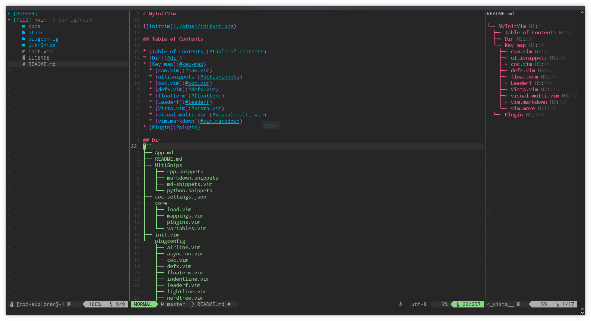

# MyInitVim
 

## Table of Contents

- [MyInitVim](#myinitvim)
	- [Table of Contents](#table-of-contents)
	- [Dir](#dir)
	- [plug Key map](#plug-key-map)
		- [caw.vim](#cawvim)
		- [ultisnippets](#ultisnippets)
		- [coc.vim](#cocvim)
		- [defx.vim](#defxvim)
		- [floatterm](#floatterm)
		- [Leaderf](#leaderf)
		- [Vista.vim](#vistavim)
		- [visual-multi.vim](#visual-multivim)
		- [vim.markdown](#vimmarkdown)
		- [vim.move](#vimmove)
		- [fzf](#fzf)
		- [gitgutter](#gitgutter)
	- [Plugin](#plugin)

## Dir

```
.
├── core
│   ├── coc-settings.json
│   ├── functionGather.vim
│   ├── load.vim
│   ├── mappings.vim
│   ├── plugins.vim
│   └── variables.vim
├── init.vim
├── other
│   ├── App.md
│   ├── gatherFunctionImplByPython.py
│   └── initvim.png
├── plugconfig
│   ├── airline.vim
│   ├── asyncrun.vim
│   ├── coc.vim
│   ├── defx.vim
│   ├── floaterm.vim
│   ├── fzf.vim
│   ├── indentline.vim
│   ├── leaderf.vim
│   ├── lightline.vim
│   ├── nerdcommenter.vim
│   ├── nerdtree.vim
│   ├── snippets.vim
│   ├── treesitter.vim
│   ├── ultisnippets.vim
│   ├── vista.vim
│   └── visualmulti.vim
├── README.md
└── UltiSnips
    ├── cmake.snippets
    ├── cpp.snippets
    ├── markdown.snippets
    ├── md-snippets.vim
    └── python.snippets
```


* file
	- coc-settings.json : config file used to complete
	- init.vim : vim config file entrance


## plug Key map

### caw.vim

| key | function                                                      |
|:---:|:--------------------------------------------------------------|
| gci | insert comment in front of cursor                             |
| gcI | insert comment mark in front of the line                      |
| gca | intsert comment mark in back of cursor                        |
| gcA | insert comment mark in back of the line                       |
| gco | insert comment mark on the next line                          |
| gcO | insert comment mark on the previous line                      |
| gcw | insert comment mark wrap a word                               |
| gcb | insert block comment mark warp code selected in visual module |

### ultisnippets

| Key   | function              |
|:-----:|:---------------------:|
| Ctrl+j| complete call snippet |

### coc.vim


| Key        | function                          |
|:----------:|:---------------------------------:|
| Tab        | toggle complete                   |
| <leader>k  | show doc                          |
| <ctrl>o    | show function return              |
| <ctrl>j    | next placeholder                  |
| <ctrl>k    | previous placeholder              |
| <leader>a  | selected code action              |
| <leader>ac | code action                       |
| <leader>af | fix code                          |
| <leader>rn | refactor, rename variables        |
| gd         | go definition                     |
| gD         | go definition in new tab          |
| gy         | go to type definition             |
| gi         | go to implementation              |
| gr         | go to reference                   |
| gs         | show git chunkinfo                |
| ]e         | go to next error                  |
| [e         | go to previous error              |
| [g         | go to next git chunk              |
| ]g         | go to previous git chunk          |
| f          | smartf forward                    |
| F          | smartf backward                   |
| ;          | smartf repeat                     |
| :          | smartf repeat opposite            |
| :Format    | use to format current buffer code |

### floatterm


| Key   | function                |
|:-----:|:-----------------------:|
| <F12> | toggle a float terminal |

### Vista.vim

> show file structure

| Key       | function        |
|:---------:|:---------------:|
| <leader>v | open a tag tree |

### visual-multi.vim

> multi-cursor

| Key    | function                   |
|:------:|:--------------------------:|
| Ctrl+n | activate multi cursor env  |
| n      | next pattern in cursor     |
| N      | previous pattern in cursor |
| q      | quit in cursor             |


### vim.markdown

> write markdown in vim

| Key          | function                |
|:------------:|:-----------------------:|
| :TableFormat | format table            |
| :InsertToc   | insert table of content |
| [[           | go to previous header   |
| ]]           | go next header          |

### vim.move

> move whole line up or down

| Key | function                               |
|:---:|:---------------------------------------|
| A-k | Move current line/selection up         |
| A-j | Move current line/selection down       |
| A-h | Move current character/selection left  |
| A-l | Move current character/selection right |

### fzf

> find file fuzzy

| key     | function  |
|:-------:|:---------:|
| <ctrl>f | equal :Ag |

fzf plugin not mapping key, but it need some config in `.zshrc` and other software.

```shell
# write in .zshrc file
export FZF_DEFAULT_OPTS="--height 70% --layout=reverse --preview '(highlight -O ansi {} || cat {}) 2> /dev/null | head -500'"
export FZF_DEFAULT_COMMAND='ag --hidden --ignore={.git,.cache} -ignore-dir={node_modules,build} -g ""'
```

software
- **ag** `the_silver_searcher` 

### markdown-preview

| key              | function                            |
|:----------------:|:-----------------------------------:|
| :MarkdownPreview | for markdown preview in web broswer |


### Vim-autopairs


## Plugin

* My vimrc plug:

- Plug 'itchyny/lightline.vim'
- Plug 'jiangmiao/auto-pairs'
- Plug 'liuchengxu/vista.vim'
- Plug 'voldikss/vim-floaterm'
- Plug 'mhinz/vim-startify'
- Plug 'godlygeek/tabular'
- Plug 'iamcco/markdown-preview.nvim', { 'do': { -> mkdp#util#install() }, 'for': ['markdown', 'vim-plug']}
- Plug 'plasticboy/vim-markdown'
 
- Plug 'tpope/vim-surround'
- Plug 'Yggdroot/indentLine'
- Plug 'junegunn/fzf', { 'do': { -> fzf#install() } }
- Plug 'junegunn/fzf.vim'
- Plug 'tyru/caw.vim'
- Plug 'mg979/vim-visual-multi', {'branch': 'master'}
- Plug 'matze/vim-move'
- Plug 'ryanoasis/vim-devicons'
- Plug 'itchyny/vim-cursorword'
- 
- Plug 'neoclide/coc.nvim',{'branch':'release'}
- Plug 'morhetz/gruvbox'
- Plug 'rakr/vim-one'
- Plug 'joshdick/onedark.vim'
- Plug 'arcticicestudio/nord-vim'

* table describe

| Rec                            | Plug Name                                                         | Desc                                |
|:------------------------------:|:-----------------------------------------------------------------:|:------------------------------------|
| :star::star::star::star:       | [lightline.vim](https://www.github.com/itchyny/lightline.vim)     | status column                       |
| :star::star::star::star:       | [auto-pairs](https://www.github.com/jiangmiao/auto-pairs)         | auto complete {} () []              |
| :star::star::star:             | [vista.vim](https://www.github.com/liuchengxu/vista.vim)          | show tags, acquired ctags support   |
| :star::star::star::star::star: | [vim-floaterm](https://www.github.com/voldikss/vim-floaterm)      | float terminal                      |
| :star::star:                   | [vim-startify](https://www.github.com/mhinz/vim-startify)         | start menu                          |
| :star::star::star::star::star: | [markdown-preview.nvim](https://www.github.com/markdown)          | markdown preview using broswer      |
| :star::star::star:             | [vim-markdown](https://www.github.com/plasticboy/vim-markdown)    | hihtlight markdown syntax           |
| :star::star::star::star:       | [tabular](https://www.github.com/godlygeek/tabular)               | format table                        |
| :star::star::star:             | [vim-surround](https://www.github.com/tpope/vim-surround)         | add sign between a word or sentence |
| :star::star::star:             | [indentLine](https://www.github.com/Yggdroot/indentLine)          | indent line for python              |
| :star::star::star::star:       | [vim-visual-multi](https://www.github.com/mg979/vim-visual-multi) | multi cursor                        |
| :star::star::star:             | [vim-move](https://www.github.com/matze/vim-move)                 | move code                           |
| :star::star::star:             | [vim-devicons](https://www.github.com/ryanoasis/vim-devicons)     | icons                               |
| :star::star::star::star:       | [vim-cursorword](https://www.github.com/itchyny/vim-cursorword)   | highlight current word              |
| :star::star::star::star::star: | [coc.nvim](https://www.github.com/neoclide/coc.nvim)              | Main function:complete              |
| :star::star::star::star:       | [vim-gitgutter](https://www.github.com/morhetz/gruvbox)           | git staus shows                     |
| :star::star::star:             | [gruvbox](https://www.github.com/joshdick/onedark.vim)            | theme                               |
| :star::star::star::star:       | [caw.vim](https://www.github.com/tyru/caw.vim)                    | Annoatation                         |
| :star::star::star::stars::tar: | [fzf.vim](https://www.github.com/junegunn/fzf.vim)                | search                              |


:bell:**Note** in coc managerment, install plug behind
- coc-clangd\
	`install clangd`
- :star:coc-explorer
- coc-go\
	`install gopls`
- coc-html
- coc-json
- coc-pyright
- coc-snippets
- coc-tsserver
- coc-vimlsp
- coc-yank

Their coc-settings.json file save config and detail info can refer to their repo perspactivly

* plug set place
